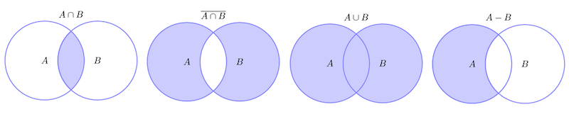

- [Comentarios](#comentarios)
- [Definición de variable](#definición-de-variable)
  - [Tipos de variable](#tipos-de-variable)
  - [Tratamiento de strings](#tratamiento-de-strings)
    - [Formateo](#formateo)
    - [Métodos string](#métodos-string)
  - [Operadores](#operadores)
- [Sentencias de control / bucles](#sentencias-de-control--bucles)
  - [If](#if)
  - [match](#match)
- [Colecciones](#colecciones)
  - [Listas](#listas)
    - [Acceso a elementos](#acceso-a-elementos)
    - [Modificar elementos a una lista](#modificar-elementos-a-una-lista)
    - [Añadir elementos de una lista](#añadir-elementos-de-una-lista)
    - [Borrar elementos de una lista](#borrar-elementos-de-una-lista)
    - [Otras accione elementos en una lista (recorrer, buscar, ordenar)](#otras-accione-elementos-en-una-lista-recorrer-buscar-ordenar)
  - [Tuplas](#tuplas)
    - [Operaciones](#operaciones)
  - [Set o conjuntos](#set-o-conjuntos)
    - [Acceder a las posiciones de un set](#acceder-a-las-posiciones-de-un-set)
    - [Añadir elementos a un conjunto](#añadir-elementos-a-un-conjunto)
    - [Eliminar elementos de un array](#eliminar-elementos-de-un-array)
    - [Teoria de conjuntos](#teoria-de-conjuntos)
      - [Unión](#unión)
      - [Diferencia](#diferencia)
      - [Diferencia simétrica](#diferencia-simétrica)
  - [Diccionarios](#diccionarios)
    - [Acceder a elementos de un diccionario](#acceder-a-elementos-de-un-diccionario)
    - [Añadir un elemento al diccionario](#añadir-un-elemento-al-diccionario)
    - [Eliminar elementos del diccionario](#eliminar-elementos-del-diccionario)
    - [Acciones masivas](#acciones-masivas)
- [Funciones](#funciones)
- [Módulos](#módulos)
- [Clases](#clases)
  - [Herencia](#herencia)
- [Módulos](#módulos-1)


# Comentarios

Comentario de una se utiliza el carácter #

```py
# esto es un ejemplo de comentario
```
Para poner comentarios de lineas múltiples se utiliza el caracter """

```py
""" esto es un ejemplo de comentario
de lineas multiples para comentar código
"""
```
# Definición de variable

Python es un lenguaje no tipado, por lo que no es necesario indicar el tipo de variable en el momento que se crea. PAra poder declarar una variable se realiza mediante el nombre de la referencia y su valor:

```py
nombre_variable = valor
operandoUno = 2
```

Una vez se quiera utilizar la variable tan solo es necesario nombrarla

```py
print(operandoUno)
```

## Tipos de variable

- Numéricos: se trata de los números reales, enteros y complejos

```py
numero = 8
numeroDecimal = 4.23
numeroComplejo = 4.21j
```

- Cadenas de texto: A diferencia de otros lenguajes de programación, en este caso no se diferencia entre mayúsculas y caracteres, por lo que una palabra va guardada entre el simbolo de '

```py
saludo = 'Hola esto es un ejemplo'
```

- Booleanos: elementos utilizados para poder realizar comprobaciones. Los únicos valores que pueden guardar este tipo de variables son True / False

```py
acierto = False
```

Además de poder asignar las variables de la forma que hemos visto, tambien es posible hacer una asignación múltiple, para ello primero se declarar un luego se les daá el valor de forma conjunta como en el siguiente ejemplo

```py
name, lastName, adress = 'Borja', 'Martin', 'Madrid'
print(name)
```


## Tratamiento de strings

Como hemos visto en la definición de variables, los strings son las palabras. Este tipo de variable tiene un tratamiento muy especial ya que cuenta con multitud de métodos que pueden ser ejecutados. 

```py
letra = 'a'
palabra = 'introducción a python'
palabraMultiple = """ Esto es la escritura de una variable
donde están escritas varias lineas, pero asignadas a la misma variable
"""

print(letra)
print(palabra)
print(palabraMultiple)
```

### Formateo

En el caso de querer concatenar strings, al igual que en el resto de lenguajes de programación, se realiza mediante el operador +. Esta concatención en muchos de los casos es un poco tediosa, siendo mucho mejor utilizar el formateo de string. Para ello se utilizan las banderas %s para string %d para enteros %f para decimales

```py
apellido = 'Martin'
asignatura = 'SGE'
anio = 2023

print('Este repositorio ha sido realizado por %s %s para la asignautar de %s en el año %d' %
      (nombre, apellido, asignatura, anio))
```

A partir de la versión 3 de Pyhton, existe otras formas de formateo mediante la siguiente sintaxis. La primera es mediante el método format

```py
print('Este repositorio ha sido realizado por {} {} para la asignautara de {} en el año {}'.format(nombre, apellido, asignatura, anio))
```

En este caso no es necesario indicar ningún tipo de bandera, sin tener en cuenta los tipos de las variables

Otro de los nuevos métodos de formateo es con la interpolación. Esto se realiza mediante la función f

```py
print(f'Este repositorio ha sido realizado por {nombre} {apellido} para la asignatura de {asignatura} en el año {anio}')
```

### Métodos string

Alguno de los métodos destacados de string son los siguientes: 

- leng(): obtiene la longitud de la palabra indicada

```py
print(f'La longitud de {nombre} es {len(nombre)}')
```

- CharAt: No existe un método como tal, sino que simplemente se trata de un acceso por posición, como si fuese un array.

```py
print(f'La longitura de {nombre} es {len(nombre)}')
letra = nombre[0]  # B
letra = nombre[len(nombre)-1]  # a
```

- Slice: permite obtener un substring de una palabra, indicando el punto de inicio y el punto de final

```py
correo = 'developandsystem@gmail.com'
dominio = correo[correo.index('@'):len(correo)]
```

Como se ha podido ver, todos los elementos indicados no son en realidad método, sino funciones que se pueden aplicar a los elementos de tipo string. Los principales métodos de los elementos de tipo string son los siguientes: 

- capitalize(): Permite pasar la primera letra de un string a mayúsculas

```py
palabraInicial = 'esto es un ejemplo'
print(palabraMultiple.capitalize())  # 'Esto es un Ejemplo'
```

- count(): Obtiene el número de elementos que se indican en el método

```py
frase = 'esta frase está echa para poder buscar todos los elementos de la misma'
print(frase.count('a')) # 8
print(frase.count('es')) # 2
```

- endswith(): Devuelve True o False dependiendo si el string indicado termina con la palabra que se dice

```py
frase = 'esta frase está echa para poder buscar todos los elementos de la misma'
print(frase.endswith("mos")) # false
print(frase.endswith("isma")) # true
```

- find(): Retorna el index de la primera coincidencia encontrada. En caso de no encontrar nada devolverá -1

```py
frase = 'esta frase está echa para poder buscar todos los elementos de la misma'
print(frase.find("f"))  # 5
```

Existen otros métodos como isDigit, isDecimal, isNumeric que pueden ser muy útiles a la hora de evaluar datos. Todos ellos retornan un booleano, indicando si cumple o no la condición de búsqueda

## Operadores

Los operadores en python son

- Asignación: aquellos que permiten asignar valores a variables. Cabe destacar los siguientes
  - =, +=, -=, *=, /=, %=
- Aritméticos: Aquellos que permiten realizar operaciones de suma (+), resta (-), multiplicación (*), división(/), modulo (%) y exponente (**)
- Comparación Aquellos que permiten realizar comprobaciones sobre algun tipo de condición. La salida de estos operadores siempre será un operador booleano. Se pueden destacar las siguientes: igual (==), diferente (!=), mayor (>), mayor igual (>=), menor (<), menor igual (<=)
- Lógicos: Aquellos que permiten juntar el resultado de más de una condición de comparación. Entre estos operadores podemos destacar sobre todo tres: y (and), ó (or)

# Sentencias de control / bucles

## If

```py
numero = 7
if numero == 0:
    print("numero es 0")
elif numero < 5:
    print("numero entre 1 y 4")
elif numero < 9:
    print("numero entre 5 y 8")
else:
    print("numero 9 o 10")
```

## match

```py
numero = 7
match numero:
    case 1:
        print("valor 1")
    case 2:
        print("valor 2")
    case 3:
        print("valor 3")
    case _:
        print("valor no contemplado")

```

# Colecciones

Las colecciones son tipos de datos que permiten guardar elementos de forma conjunta en una misma estructura de datos. En Pyhton existen principalmente 4 tipos de colecciones:

- List:se trata de una colección ordenada y de tamaño mutable
- Tupla: se trata de una colección ordenada y de tamaño no mutable 
- Set: se trata de una colección no ordenada, sin indice.
- Diccionario: se trata de una colección no ordenada, modificable e indexada

## Listas

Una lista es un conjunto de datos que se guarda en una variable que representa la estructura de almacenamiento. Para poder definirla se puede hacer de dos formas: 

```py
numeros = [1, 2, 3, 4, 5, 6, 7]
print(numeros)

palabras = list()
```

Una vez creada una lista las operaciones que se pueden hacer son las siguientes

### Acceso a elementos

El acceso a los elementos de una lista se realiza mediante posiciones, sabiendo que la posición del primer elemento siempre será la 0.

```py
numeros = [1, 2, 3, 4, 5, 6, 7]
print(numeros[0])  # 1
print(numeros[len(numeros)-1])  # 7
```
De la misma forma, en python está disponible acceder a los elementos mediante indices negativos, siendo -1 el último elemento

```py
numeros = [1, 2, 3, 4, 5, 6, 7]
print(numeros[-1])  # 7
print(numeros[-len(numeros)])  # 1
```

En el caso de querer hacer un acceso a un subconjunto, tal y como hemos visto con los strings, se podría hacer indicando la posicion inicial y final

```py
numeros = [1, 2, 3, 4, 5, 6, 7]
subconjunto = numeros[2:4]
print(subconjunto) # [3,4]
```

### Modificar elementos a una lista

Para poder modificar elementos en una lista, basta con indicar la posición del elemento que se quiere modificar y asignar el nuevo valor

```py
numeros = [1, 2, 3, 4, 5, 6, 7]
numeros[0] = -1
print(numeros) # [-1, 2, 3, 4, 5, 6, 7]
```

En el caso de querer modificar un subconjunto se podría, indicando el acceso de la misma forma que se ha explicado antes

```py
numeros = [1, 2, 3, 4, 5, 6, 7]
numeros[0:3] = [9, 8, 7]
print(numeros) # [9, 8, 7, 4, 5, 6, 7]
```

### Añadir elementos de una lista

Tal y como se ha dicho al principio, un objeto de tipo list es una colección que tiene un tamaño mutable, por lo que se pueden tanto agregar como eliminar elementos nuevos. Para poder agregarlos se utilizan los métodos append y/o extends, dependiendo de cual sea el número de elementos que se quieran añadir

```py
palabras = list()
palabras.append("Ejemplo")
palabras.append("de")
palabras.append("añadir")
palabras.append("elementos")
print(palabras)
```
ó

```py
palabras = list()
palabras.extend(["Ejemplo", "de", "como", "añadir", "elementos"])
print(palabras)
```
Por último, existe la posibilidad de agregar elementos en posiciones determinadas. Para ello es necesario utilizar el método insert, indicando el elemento a añadir y la posición donde se quiere poner

```py
numeros = [1, 2, 3, 4, 5, 6, 7]
numeros.insert(1, 10)
print(numeros) # [1, 10, 2, 3, 4, 5, 6, 7]
```

Además de estos tres métodos, también se pueden realizar operaciones aritméticas sobre las list. En el caso de utilizar el operados +, las dos list indicadas se sumarán, obteniendo una completa

```py
lista1 = ["primero","segundo","tercero"]
lista2 = ["cuarto","quinto","sexto"]

listaResultante = lista1 + lista2
print(listaResultante) #['primero', 'segundo', 'tercero', 'cuarto', 'quinto', 'sexto']
```

En el caso de utilizar el operados *, el resultado será la repeticion tantas veces come se indique de la lista

```py
lista1 = ["primero", "segundo", "tercero"]
listaResultante = lista1 * 2
print(listaResultante) # ['primero', 'segundo', 'tercero', 'primero', 'segundo', 'tercero']
```

### Borrar elementos de una lista

Para poder borrar los elementos de una lista, existen diferentes posibilidades: 

- la sentencia del, indicando la colección de donde se quiere eliminar y el indice del elemento que se quiere quitar
```py
listaElementos = ["Elemento 1", "Elemento 2", "Elemento 3", "Elemento 4"]
del listaElementos[2]
print(listaElementos) #['Elemento 1', 'Elemento 2', 'Elemento 4']
```
Una vez borrado el elemento, el resto se movilizan una posición
  
-  Además de la sentencia del, se pueden utilizar los métodos remove y pop. El método remove se basa en eliminar elementos concretos, quitando de la lista el primer elemento que coincidan con la búsqueda. En el caso del método pop, tienen un funcionamiento muy similar a la sentencia del, con la diferencia que ademas de eliminar el elemento, lo devuelve. Además, también se puede 

```py
listaElementos = ["Elemento 1", "Elemento 2",
                  "Elemento 3", "Elemento 4", "Elemento 1"]
listaElementos.remove('Elemento 1')
print(listaElementos) # ['Elemento 2', 'Elemento 3', 'Elemento 4', 'Elemento 1']
```
en el caso del método pop su uso sería el siguiente

```py
listaElementos = ["Elemento 1", "Elemento 2",
                  "Elemento 3", "Elemento 4", "Elemento 1"]
print(f'Elemento {listaElementos.pop(0)} eliminado con éxito') # Elemento Elemento 1 eliminado con éxito
print(listaElementos) # ['Elemento 2', 'Elemento 3', 'Elemento 4', 'Elemento 1']
```

Es importante saber que en el método pop, si no se indica un indice, el elemento que se elimina es el último

### Otras accione elementos en una lista (recorrer, buscar, ordenar)

Para poder recorrer elementos dentro de una lista, se utiliza el bucle for 

```py
for item in listaElementos:
    print(item)
```

Para poder comprobar si un elemento está dentro de la lista, se utiliza la sentencia if in

```py
if 'Elemento 1' in listaElementos:
    print('El elemento está en la lista')
```
Para poder ordenar una lista se utiliza el método sort

```py
listaElementos = ["Elemento 4", "Elemento 2",
                  "Elemento 1", "Elemento 3"]
listaElementos.sort()
print(listaElementos) # ['Elemento 1', 'Elemento 2', 'Elemento 3', 'Elemento 4']
```

## Tuplas

Las tuplas son colecciones de datos muy similares a las lista, con la diferencia que se trata de elementos no mutables por lo que no se puede cambiar su contenido. Para pode inicializar una tupla se utiiza la siguiente sentencia:

```py
lista = tuple()
listaCosas = (1,2,3,4,5,6)
```

A la hora de trabajar con los elementos, se realiza exactamente de la misma forma que con las listas, trabajando por posiciones

### Operaciones

Alguna de las acciones que pueden ser interesantes a la hora de trabajar con las tuplas son las siguientes: 

- Comprobar si un elemento está en la tupla: se utiliza la sentencia in

```py
categorias = ("financias", "it", "ventas", "marketing")
print('it' in categorias) # true
```

- Eliminar tuplas: Si bien no se puede eliminar elementos de una tupla al tratarse de elementos no mutables, si se puede eliminar una tupla completa para así poder liberar memoria. Para ello se utiliza la función del

```py
categorias = ("financias", "it", "ventas", "marketing")
del categorias
```
- Buscar el número de elementos que hay en una lista: Para poder encontrar el número de elementos que hay en una lista se puede utiliza el método count.

```py
listaCosas = (1, 2, 3, 4, 5, 6, 1, 2, 1, 1, 4)
print(listaCosas.count(1)) # 4
```

- Buscar el indice de un elemento concreto: utilizando el método index se obtiene cual es la posición de un elemento indicado

```py
listaCosas = (1, 2, 3, 4, 5, 6, 1, 2, 1, 1, 4)
print(listaCosas.index(2)) # 2
```

## Set o conjuntos

Los sets son estructuras de datos similares a las listas con las siguientes diferencias:

- Cada uno de los elementos del set es único, no puede haber elementos duplicados
- Los elementos son inmutables

Para poder crear un set te utiliza el método set(), indicando cuales son cada uno de los elementos de la colección o directamente cada uno de los elementos entre {}

```py
elementos = set(["elemento 1", "elemento 2", "elemento 3"])
elementos = {"elemento 1", "elemento 2", "elemento 3"}
```

### Acceder a las posiciones de un set

Para poder acceder a los elementos del set, no se puede acceder por posiciones, teniéndose que hacerse mediante un bucle

```py
elementos = {"elemento 1", "elemento 2", "elemento 3"}
for i in elementos:
    print(i)
```

### Añadir elementos a un conjunto

Para poder agregar elementos a un conjunto se utiliza el método add

```py
elementos = {"elemento 1", "elemento 2", "elemento 3"}
elementos.add("elemento adicional")
```
### Eliminar elementos de un array

Para poder eliminar elementos dentro de un conjunto se utiliza el método remove

```py
elementos = {"elemento 1", "elemento 2", "elemento 3"}
elementos.add("elemento adicional")
elementos.remove("elemento 1")
```

### Teoria de conjuntos



Adicionalmente a todas las acciones que se pueden realizar sobre los conjuntos, existen las operaciones de to¡eoria de conjuntos, pudiendo obtener un conjunto determinado de elementos dependiendo del método aplicado.

#### Intersección

Se obtienen los elementos que están al mismo tiempo en el conjunto 1 y conjunto 2

```py
conjunto1 = {1, 2, 3, 4, 5, 6, 7, 8}
conjunto2 = {4, 5, 9, 10, 11, 12}

conjuntoResultante = conjunto1.intersection(conjunto2)
print(conjuntoResultante) ## {4,5}
```
#### Unión

Se obtienen todos los elementos, tanto aquellos que están en el conjunto1 como en el conjunto2

```py
conjunto1 = {1, 2, 3, 4, 5, 6, 7, 8}
conjunto2 = {4, 5, 9, 10, 11, 12}

conjuntoResultante = conjunto1.union(conjunto2)
print(conjuntoResultante) # {1, 2, 3, 4, 5, 6, 7, 8, 9, 10, 11, 12}
```

#### Diferencia

Se obtienen todos los elementos del conjunto uno excepto aquellos que están presentes en el segundo indicado

```py
conjunto1 = {1, 2, 3, 4, 5, 6, 7, 8}
conjunto2 = {4, 5, 9, 10, 11, 12}

conjuntoResultante = conjunto1.difference(conjunto2)
print(conjuntoResultante) # {1, 2, 3, 6, 7, 8}
```
#### Diferencia simétrica

Se obtienen todos los elementos de ambos conjuntos expcepto aquellos que sean coincidentes

```py
conjunto1 = {1, 2, 3, 4, 5, 6, 7, 8}
conjunto2 = {4, 5, 9, 10, 11, 12}

conjuntoResultante = conjunto1.symmetric_difference(conjunto2)
print(conjuntoResultante) # {1, 2, 3, 6, 7, 8, 9, 10, 11, 12}
```

## Diccionarios

Los diccionarios es una colección mutable de elementos organizados con un par clave - valor. Para poder crear un diccionario se utiliza o bien las {} o bien la función dict o directamente la definición del mismo

```py

informe = {'nombre': "informe ventas", 'prioridad': 'alta',
           'elementos': ['cabecera', 'contenido', 'totales']}
lista = ["ventas", "finanzas", "marketing", ""]
listaDict = dict(["a1", "b2", "c3", "d4"])

print(type(informe))
print(type(lista))
print(type(listaDict))

print(informe) #{'nombre': 'informe ventas', 'prioridad': 'alta', 'elementos': ['cabecera', 'contenido', 'totales']}
print(lista) #['ventas', 'finanzas', 'marketing', '']
print(listaDict) #{'a': '1', 'b': '2', 'c': '3', 'd': '4'}
```

### Acceder a elementos de un diccionario

Para poder acceder a elementos de un diccionario tan solo es necesario indicar la clave a la que se quiere acceder, obteniendo el valor asociado:

```py
informe = {'nombre': "informe ventas", 'prioridad': 'alta',
           'elementos': ['cabecera', 'contenido', 'totales']}

print(informe["nombre"]) # informe ventas
```

ADicionalmente también se puede acceder a los elementos utilizando el método get

```py
informe = {'nombre': "informe ventas", 'prioridad': 'alta',
           'elementos': ['cabecera', 'contenido', 'totales']}

informe.get("nombre") # informe ventas
```

La funcionalidad es exactamente igual, la única diferencia con respecto al acceso por clave es que en el caso de no encontrar la clave no se obtiene una excepción

### Añadir un elemento al diccionario

Para poder añadir un elemento al diccionario, basta con indicar la nueva key y asignarle el valor deseado

```py
informe["cliente"] = "Universidad Europea"
```

Al igual que se puede añadir, también se puede modificar el valor de una clave ya existente

### Eliminar elementos del diccionario

Para pode eliminar elementos del diccionario se puede hacer de diferentes formas:

- Mediante la función del:

```py
informe = {'nombre': "informe ventas", 'prioridad': 'alta',
           'elementos': ['cabecera', 'contenido', 'totales']}
del (informe["prioridad"])
```

- Mediante la función pop

```py
print(f'eliminado el elemento {informe.pop("elementos")}')
```
  
A diferencia del método anterior, el método pop ademas de borrar el elemento correspondiente también lo devuelve para poder utilizarlo

### Acciones masivas

En el caso de querer acceder a todos los elementos o claves de un diccionario, se puede utilizar el método key() o el método values(). Ambos métodos permiten la obtención de una lista de elementos (claves o valores según el método) e iterar sobre ellos mediante un bucle

```py
for i in informe.keys():
    print(i)

for i in informe.values():
    print(i)

```

# Funciones

Para poder crear una función en Python se utiliza la palabra reservada def, seguida del nombre de la función, los parámetros que necesita y por último :. Esto indica que la función empezará a definir el cuerpo

```py
def funcionImprimir(mensaje):
    print(f'el {mensaje} se ha impreso correctamente')
```

En el caso de que se quiera que la función devuelva algo, la última sentencia de la función será un return

```py
def suma(op1, op2):
    resultado = op1+op2
    print('Suma realizada con éxito')
    return resultado

resultado = suma(4, 9)
print(resultado)  # 13
```
Una cosa importante que hay que tener en cuenta, es que a diferencia de otros lenguajes como por ejemplo javascript, si en la definición de la función se indica que en número de parámetros a pasar es de 2, esta no podrá ser llamada sin menos parámetros

```py
def suma(op1, op2):
    resultado = op1+op2
    print('Suma realizada con éxito')
    return resultado


resultado = suma(4)
# TypeError: suma() missing 1 required positional argument: 'op2'
```

Si se quiere tener la posibilidad de pasar un solo parámetro y que el resto no se pasen, se pueden utilizar los parámetros por defecto, los cuales son utilizados cuando se define la función

```py
multiplicacion(9, 2)  # 18
multiplicacion(9)  # 9
```

En el caso de querer pasar un número de argumentos indeterminado, se utiliza el caracter * para indicar que el número de parámetros será entre 0 y n

```py
def sumarTodos(*elementos):
    sumatorio = 0
    for item in elementos:
        sumatorio += item
    print(
        f'El resultado de sumar todos los elementos pasados es de {sumatorio}')

sumarTodos(1, 4, 5, 6, 7, 3, 1, 0)
```

Cuando se pasan parámetros en python se pueden realizar mediante posiciones, o mediante nominales. Los posicionales son los normales, aquellos que van colocados en un orden determinado. Los nominales son aquellos que van asignados a un parámetro concreto

```py
def generarInforme(contenido, titulo, elementos):
    print(titulo)
    for i in contenido:
        print(i)
    print(f'los elementos pasados para el informe son {elementos}')


generarInforme(["Esto es un ejemplo de contenido", "para mostrar en un informe"],
               "Informe posicional", [1, 2, 3, 4])

```

Además de poder darle est uso normal, también se pueden pasar parámetros indicando a cual es al que se asigna no teniendo que guardar la relación de posición 

```py
generarInforme(elementos=["Esto es un ejemplo de contenido", "para mostrar en un informe"],
               titulo="Informe posicional", contenido=[1, 2, 3, 4])
```

Esto es mu útil cuando se utilizan parámetros con valores por defecto.
# Módulos

Los módulos, ayudan a que el código sea mucho más comprensible y escalable, ya que permite independizar en ficheros funciones y/o elementos para que sean reutilizados en diferentes sitos. Para poder crear un módulo basta con crear un archivo py, el cual puede contener variables, funciones, clases y/o ejecutables

Imaginemos el siguiente fichero con tres funciones declaradas

```py
def funcionImprimir(mensaje):
    print(
        f'El mensaje que se ha mandado a imprimir es el siguiente: {mensaje}')

def sumarElementosList(lista, *elementos):
    lista.extend(elementos)
    return lista

def obtenerSubconjuntoList(lista, pos1, pos2):
    listaResultado = lista[pos1:pos2]
    print('La operacion se ha llevado a cabo con éxito')
    print(f'Se ha obtenido una lista de {len(listaResultado)} elementos')
    return listaResultado
```

En el caso de que estas funciones se quieran utilizar en diferentes sitios, deben ser llamadas desde el módulo, por lo que lo primero será importarlo

```py
import modfunciones
```

Una vez hecho esto, todas las funciones y elementos que están declarados dentro del módulo serán accesible a través del nombre del mismo.

```py
import modfunciones
modfunciones.funcionImprimir('Importacion correcta')
lista = modfunciones.obtenerSubconjuntoList([1, 2, 3, 4, 5, 6, 7], 2, 4)
print(lista)
lista = modfunciones.sumarElementosList([], 1, 2, 3)
print(lista)
```

Esta es la importación clásica, pero también podemos renombrar el módulo para que sea más fácil de manejar con la siguiente sintaxis

```py
import modulo as m
```

o también importar solo parte del módulo

```py
from modulo import funcion_general as fun1, funcion_especifica as fun2
```

# Clases

Para poder definir una clase se utiliza la palabra reservada class. En el caso de querer tener un constructor, es necesario utilizar la funcion __init__, la cual actual como constructor por defecto o parametrizado. Dentro de ella, existirán tantos parámetros como se consideren necesarios, siendo uno de ellos el parámetro self, el cual ayudará a igualar los elementos a variables de clase

```py
class Producto:
    def __init__(self, nombre, descripcion, precio):

        self.nombre = nombre
        self.descripcion = descripcion
        self.precio = precio


producto = Producto("Ordenador", "Ordenador personal para trabajar", 1000)

print(producto.nombre)
print(producto.descripcion)
print(producto.precio)

```

Como se puede ver en el ejemplo, esta clase tiene un parámetro por defecto que es el self, el cual hace referencia a una instancia de la propia clase. Este tipo de parámetros se utiliza en todos aquellos métodos que se quieran definir, pudiendo así acceder a cualquier parte del objeto

```py
class Producto:
    def __init__(self, nombre, descripcion, precio):

        self.nombre = nombre
        self.descripcion = descripcion
        self.precio = precio

    def mostrarDatos(self):
        print(f'El nombre del producto es {self.nombre}')
        print(f"f La descripción del producto es {self.descripcion}")
        print(f"f El precio del producto es {self.precio}")


producto = Producto("Ordenador", "Ordenador personal para trabajar", 1000)

producto.mostrarDatos()
```

Del mismo modo que se pueden definir un constructor parametrizado que reciba tantos elementos como sean necesarios, también es posible indicar que algunos tengan valores por defecto. PAra ello basta con indicar el valor que se le quiere dar, el cual será utilizado en el caso de que no se pase nada

```py
class Informe:
    def __init__(self, titulo = "prueba", categoria, elementos):
        self.titulo = titulo
        self.categoria = categoria
        self.elementos = elementos

    def imprimirInforme(self):
        print(f'{self.titulo}')
        print(f'{self.categoria}')
        for item in self.elementos:
            print(f'{item}')


informe = Informe("Informe prueba", elementos =[1, 2, 3, 4, 5])
informe.imprimirInforme()
```
En el caso de querer declarar un atributo privado que se declare junto con doble gión bajo antes del nombre __

```py
class Informe:
    def __init__(self, titulo, categoria, elementos, nombre):
        self.titulo = titulo
        self.categoria = categoria
        self.elementos = elementos
        self.__nombre = nombre

    def imprimirInforme(self):
        print(f'{self.__nombre}')
        print(f'{self.titulo}')
        print(f'{self.categoria}')
        for item in self.elementos:
            print(f'{item}')


informe = Informe("Titulo", "Categoria", [
                  "elemento1", "elemento2", "elemento3"], "nombre")

print(informe.__nombre) ## error
informe.imprimirInforme()
```

En caso de querer declarar un método como estático, se acompaña a la definición del método el decorador @staticmethod
## Herencia

Una de las grandes características de los lenguajes de programación es la herencia y la posibilidad de tener una clase plantilla que le de funcionalidades a las clases que están por debajo de ella. Para este ejemplo vamos a suponer que tenemos una clase Informe que tiene las características utilizadas en la clase anterior. Adicionalmente, queremos tener informes de tipo Venta y de tipo Informativo, los cuales agregan las características de total, ivaAplicado, fechaCobro por un lado y de unidadesSolicitadas, direccionEnvio por otro. La clase general quedaría de la siguiente forma:

```py
class Informe:
    def __init__(self, titulo, categoria, elementos):
        self.titulo = titulo
        self.categoria = categoria
        self.elementos = elementos

    def imprimirInforme(self):
        print(f'{self.titulo}')
        print(f'{self.categoria}')
        for item in self.elementos:
            print(f'{item}')
```

Para poder heredar, lo único que es necesario es indicar cual en la definición de la clase la herencia

```py
class InformeVentas(Informe):
```

Automáticamente todos los elementos de la clase Informe pasan a la clase ventas. 

# Módulos

